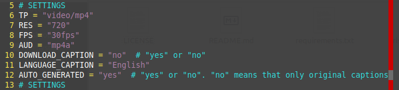

# youtube_downloader

**About:** The batch downloader of videos from Youtube

**Description:** This batch downloader can download videos from file "urls_youtube.txt" or from a playlist of Youtube. It made by the help Python 3 and the packet "pytube".

<b>Installation for Linux*:</b>

1. Clone the repository (or download the zip file and extract it):

    $ `git clone git@github.com:maninserg/youtube_downloader.git`

2. Go to the directory of the program:
   
    $ `cd <your name of directory with the program>`

2. Create of a virtual environment:

    $ `python3 -m venv .venv`

3. Activate the virtual environment:

    $ `source .venv/bin/activate`

3. Install necessary packages using pip according to the requirements.txt file from a directory with the program:

    (.venv) $ `pip install -r requirements.txt`

<i>*The installation for MacOS or Windows can be other</i>

<b>Using:</b>

1. For the download of a playlist:

    (.venv) $ `python youtube_playlist_downloader.py "<url of playlist>"`

2. For the download of videos from "url_youtube.txt" copy urls to this file. One url have to be in one row without empty rows between urls and than to use following command:
     
    (.venv) $ `python youtube_from_file_downloader.py`

You can сhoose settings for downloadable videos: a codec for the video and audio, a video resolution, a frame rate and the type of files. For this see the block of SETTINGS in the each of the files by opening it in a text editor. Also for download of a playlist you can choose the download of captions, them a language and original/auto-generated.

**Screenshots:**

  

<b>The block "SETTINGS"</b>

